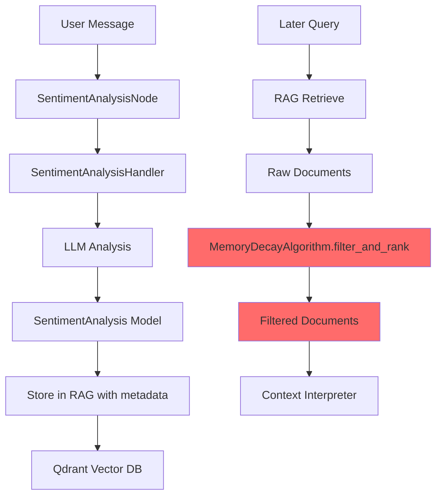
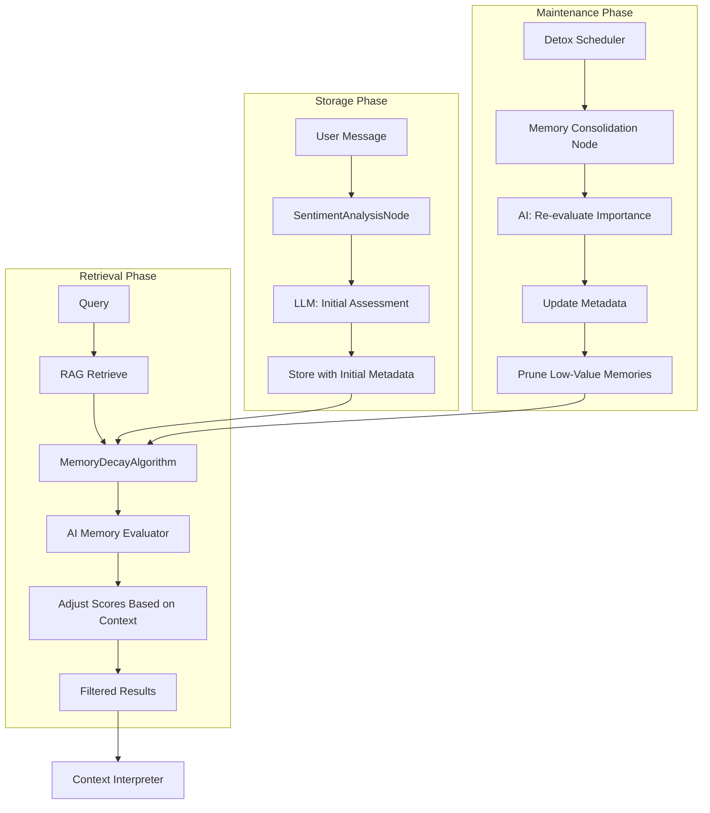
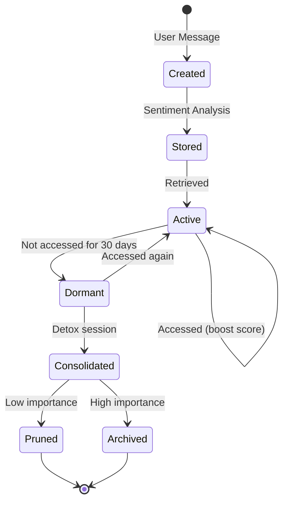

# Analysis: Memory Decay Algorithm & Detox Protocol

## Executive Summary

This document provides a comprehensive analysis of the memory decay algorithm concept, its implementation, and recommendations for improvement based on the current codebase and documentation.

---

## 1. Does the Memory Decay Algorithm Concept Hold Ground?

### 1.1 Concept Validity: **YES, with caveats**

The memory decay algorithm concept is **fundamentally sound** and aligns with established cognitive science principles. Here's why:

#### Theoretical Foundation

1. **Human Memory Analogy**: The algorithm correctly models how human memory works:
   - **Ebbinghaus Forgetting Curve**: Exponential decay is the standard model for memory retention
   - **Emotional Salience**: Important events (high relevance) persist longer than mundane information
   - **Contextual Relevance**: Different types of memories have different temporal persistence

2. **Mathematical Soundness**:
   ```python
   decay_rate = 1.0 - (chrono_relevance * chrono_weight)
   lambda_decay = ln(2) / memory_half_life_days
   decay_multiplier = exp(-decay_rate * lambda_decay * age_days)
   memory_score = relevance * decay_multiplier
   ```
   - Uses proper exponential decay formula
   - `chrono_relevance` (0.0-1.0) correctly modulates decay rate
   - `chrono_weight` provides tunable sensitivity

3. **Practical Utility**:
   - Prevents RAG context bloat by filtering out stale memories
   - Prioritizes emotionally significant events
   - Allows configurable behavior for different use cases

### 1.2 Caveats and Limitations

| Issue | Description | Impact |
|-------|-------------|--------|
| **Static Parameters** | `half_life_days` and `chrono_weight` are fixed at initialization | Cannot adapt to individual users or conversation patterns |
| **No Reinforcement** | Memories don't get "refreshed" when accessed | Important topics may decay even if frequently discussed |
| **Binary Classification** | Only uses `relevance` and `chrono_relevance` | Missing dimensions like emotional intensity, social context |
| **No Consolidation** | Similar memories aren't merged | Redundant information persists separately |
| **Metadata Dependency** | Requires `relevance`, `chrono_relevance`, `timestamp` in metadata | Falls back to raw similarity score if missing |

### 1.3 Alignment with Project Vision

The algorithm aligns well with the project's goals from [`BRAINSTORMING.md`](docs/BRAINSTORMING.md):

- **"Trust analysis"**: Memory decay could be tied to trust score
- **"Criticality pipelines"**: High-relevance memories could trigger different response modes
- **"Character consistency"**: Long-term memories help maintain companion personality
- **"Boundaries"**: Important events (e.g., family loss) should persist for appropriate responses

---

## 2. Implementation Correctness Analysis

### 2.1 Implementation Status: **PARTIALLY CORRECT**

The implementation in [`memory_chrono_decay.py`](src/rag/algorithms/memory_chrono_decay.py) is mathematically correct but has several issues:

#### 2.1.1 What's Correct

1. **Mathematical Formula**: The implementation correctly implements the documented formula
2. **Edge Case Handling**: Properly handles future timestamps and missing metadata
3. **API Design**: Clean, well-documented methods with clear responsibilities
4. **Logging**: Good debug logging for troubleshooting

#### 2.1.2 What's Incorrect or Missing

| Issue | Location | Problem | Severity |
|-------|----------|---------|----------|
| **Unused standalone functions** | Lines 15-110 | `calculate_time_decay()`, `calculate_access_boost()`, `calculate_memory_score()` are defined but never used by the class | Low (dead code) |
| **Inconsistent parameter naming** | Lines 77-110 vs 155-210 | Standalone functions use `access_count`, `retrieval_count` but class methods don't | Low (confusing) |
| **Missing access tracking** | Class implementation | Documentation mentions access boosting but implementation doesn't track access counts | Medium (feature gap) |
| **No integration with sentiment node** | [`sentiment_analysis_node.py`](src/nodes/processing/sentiment_analysis_node.py) | Sentiment analysis stores data but doesn't use memory decay for retrieval | High (integration gap) |
| **Metadata extraction fragile** | Lines 228-260 | Falls back to raw score if ANY metadata is missing, not just critical fields | Medium (overly conservative) |
| **No validation of metadata values** | Lines 229-231 | Doesn't validate that `relevance` and `chrono_relevance` are in [0,1] range | Medium (potential bugs) |

#### 2.1.3 Integration Issues

The memory decay algorithm is **not integrated** into the main pipeline:

```python
# Current flow in sentiment_analysis_node.py (lines 16-26)
async def execute(self, broker: KnowledgeBroker) -> NodeResult:
    dialogue_input = broker.dialogue_input
    sentiment = self.handler.analyze(dialogue_input.content, dialogue_input.speaker)
    if sentiment:
        broker.sentiment_analysis = sentiment
        return NodeResult(status=NodeStatus.SUCCESS, data={'sentiment': sentiment})
```

**Missing steps**:
1. No retrieval of past memories using memory decay
2. No filtering of retrieved documents by memory score
3. No feedback loop to adjust `chrono_relevance` based on actual usage

### 2.2 Data Flow Analysis



**Problem**: The red components (K, L) are **not currently connected** in the actual codebase.

---

## 3. Proposed System Design

### 3.1 Architecture Overview

The current system stores algorithm parameters as **hardcoded metadata** in RAG documents. This is problematic because:

1. **No AI reasoning**: Values are set once by LLM and never reconsidered
2. **No feedback loop**: No mechanism to adjust based on actual importance
3. **No context awareness**: Doesn't consider conversation state or user relationship

### 3.2 Proposed Solution: AI-Driven Memory Management



### 3.3 Component Design

#### 3.3.1 Memory Evaluator Node

```python
# src/nodes/algo_nodes/memory_evaluator_node.py

class MemoryEvaluatorNode(BaseNode):
    """AI-driven memory importance evaluator.
    
    Uses LLM to re-evaluate memory importance in context of:
    - Current conversation state
    - User relationship maturity (trust score)
    - Recent access patterns
    - Emotional salience
    """
    
    SYSTEM_PROMPT = """
    You are a memory importance evaluator. Given a memory and current context,
    determine its relevance and temporal persistence.
    
    Consider:
    1. Emotional impact (is this still emotionally significant?)
    2. Relationship context (how close is the user to this topic?)
    3. Recency of access (has this been discussed recently?)
    4. Trust level (how much should this influence future interactions?)
    
    Return JSON:
    {
        "relevance": 0.0-1.0,
        "chrono_relevance": 0.0-1.0,
        "reasoning": "brief explanation",
        "should_boost": boolean,
        "boost_factor": 0.0-1.0
    }
    """
    
    async def execute(self, broker: KnowledgeBroker) -> NodeResult:
        # Get retrieved documents
        documents = broker.retrieved_documents
        
        # Get context
        trust_score = broker.trust_analysis.score if broker.trust_analysis else 0.0
        conversation_state = broker.conversation_state
        
        # Evaluate each document
        evaluated_docs = []
        for doc in documents:
            evaluation = await self._evaluate_memory(
                doc, trust_score, conversation_state
            )
            evaluated_docs.append((doc, evaluation))
        
        # Apply evaluations
        broker.evaluated_memories = evaluated_docs
        return NodeResult(status=NodeStatus.SUCCESS)
```

#### 3.3.2 Memory Consolidation Node

```python
# src/nodes/algo_nodes/memory_consolidation_node.py

class MemoryConsolidationNode(BaseNode):
    """Consolidates and re-evaluates memories during idle time.
    
    Runs during detox sessions to:
    1. Re-evaluate memory importance with fresh perspective
    2. Merge similar memories
    3. Update metadata based on new understanding
    4. Prune truly irrelevant memories
    """
    
    async def execute(self, broker: KnowledgeBroker) -> NodeResult:
        # Get all memories
        all_memories = await self.rag.retrieve_all(limit=1000)
        
        # Group by topic
        topic_groups = self._group_by_topic(all_memories)
        
        # For each topic, evaluate and consolidate
        for topic, memories in topic_groups.items():
            consolidated = await self._consolidate_topic(memories)
            await self._update_memories(consolidated)
        
        return NodeResult(status=NodeStatus.SUCCESS)
```

#### 3.3.3 Enhanced RAGDocument Model

```python
# src/rag/selector.py (enhanced)

@dataclass
class RAGDocument:
    """Enhanced document model with memory metadata."""
    
    content: str
    score: float
    metadata: dict[str, Any]
    
    # Memory-specific fields (extracted from metadata)
    relevance: float = 0.5
    chrono_relevance: float = 0.5
    timestamp: datetime | None = None
    access_count: int = 0
    last_accessed: datetime | None = None
    memory_score: float = 0.0  # Calculated by MemoryDecayAlgorithm
    
    def __post_init__(self):
        """Extract memory fields from metadata."""
        self.relevance = self.metadata.get("relevance", 0.5)
        self.chrono_relevance = self.metadata.get("chrono_relevance", 0.5)
        self.access_count = self.metadata.get("access_count", 0)
        
        # Parse timestamp
        ts = self.metadata.get("timestamp")
        if ts:
            self.timestamp = self._parse_timestamp(ts)
        
        # Parse last_accessed
        la = self.metadata.get("last_accessed")
        if la:
            self.last_accessed = self._parse_timestamp(la)
```

#### 3.3.4 Enhanced MemoryDecayAlgorithm

```python
# src/rag/algorithms/memory_chrono_decay.py (enhanced)

class MemoryDecayAlgorithm:
    """Enhanced memory decay with access tracking and AI evaluation."""
    
    def __init__(self, ...):
        # ... existing init ...
        self.ai_evaluator = None  # Optional AI evaluator
    
    def score_document(
        self,
        document: RAGDocument,
        current_time: datetime | None = None,
        use_ai_evaluation: bool = False
    ) -> float:
        """Score document with optional AI re-evaluation."""
        
        # Calculate base memory score
        base_score = self._calculate_base_score(document, current_time)
        
        # Apply access boost
        access_boost = self._calculate_access_boost(document)
        
        # AI evaluation (optional)
        ai_adjustment = 0.0
        if use_ai_evaluation and self.ai_evaluator:
            ai_adjustment = await self.ai_evaluator.evaluate(document)
        
        # Combine scores
        final_score = base_score + access_boost + ai_adjustment
        
        # Store for document
        document.memory_score = final_score
        
        return final_score
    
    def _calculate_access_boost(self, document: RAGDocument) -> float:
        """Calculate boost based on access patterns."""
        if document.access_count == 0:
            return 0.0
        
        # Recent access = higher boost
        if document.last_accessed:
            days_since_access = (datetime.now() - document.last_accessed).days
            recency_factor = max(0.0, 1.0 - days_since_access / 30.0)
        else:
            recency_factor = 0.0
        
        # Logarithmic access count
        access_factor = math.log(1 + document.access_count) / 10.0
        
        return (access_factor * 0.7) + (recency_factor * 0.3)
```

### 3.4 Integration with Existing Pipeline

```python
# src/nodes/processing/sentiment_analysis_node.py (enhanced)

class SentimentAnalysisNode(BaseNode):
    """Enhanced sentiment analysis with memory integration."""
    
    async def execute(self, broker: KnowledgeBroker) -> NodeResult:
        dialogue_input = broker.dialogue_input
        
        # 1. Analyze sentiment
        sentiment = self.handler.analyze(
            dialogue_input.content, 
            dialogue_input.speaker
        )
        
        if not sentiment:
            return NodeResult(status=NodeStatus.SKIPPED)
        
        # 2. Retrieve relevant memories using memory decay
        query_embedding = self.embedding_service.encode(dialogue_input.content)
        raw_docs = self.rag.retrieve_documents(
            query_embedding=query_embedding,
            limit=100
        )
        
        # 3. Apply memory decay filtering
        memory_algo = MemoryDecayAlgorithm(
            memory_half_life_days=self.config.memory_half_life_days,
            chrono_weight=self.config.chrono_weight
        )
        
        filtered_docs = memory_algo.filter_and_rank(
            documents=raw_docs,
            threshold=self.config.memory_retrieval_threshold,
            max_docs=self.config.max_context_documents
        )
        
        # 4. Update access counts for retrieved documents
        await self._update_access_counts(filtered_docs)
        
        # 5. Store new sentiment with metadata
        self.handler._store_in_rag(dialogue_input.content, sentiment)
        
        # 6. Pass to broker
        broker.sentiment_analysis = sentiment
        broker.retrieved_memories = filtered_docs
        
        return NodeResult(status=NodeStatus.SUCCESS)
```

### 3.5 Storage Schema

```python
# Enhanced metadata structure for RAG documents

metadata = {
    # Core fields
    "timestamp": "2024-01-15T10:30:00Z",
    "memory_owner": "user",
    
    # Sentiment analysis (from LLM)
    "sentiment": "negative",
    "confidence": 0.95,
    "emotional_tone": "grieving",
    "relevance": 0.9,           # Initial LLM assessment
    "chrono_relevance": 0.95,  # Initial LLM assessment
    "context_summary": "User's mother passed away",
    "key_topics": ["family", "death", "grief"],
    
    # Memory tracking (updated by system)
    "access_count": 5,
    "last_accessed": "2024-01-20T14:22:00Z",
    "memory_score": 0.85,       # Current calculated score
    
    # AI evaluation (updated during consolidation)
    "ai_evaluations": [
        {
            "timestamp": "2024-01-20T00:00:00Z",
            "relevance": 0.92,
            "chrono_relevance": 0.93,
            "reasoning": "Still emotionally significant, discussed recently"
        }
    ],
    
    # Consolidation
    "consolidated_with": ["point_id_1", "point_id_2"],
    "is_consolidated": true
}
```

---

## 4. Additional Observations and Ideas

### 4.1 Critical Issues

1. **Detox Protocol Not Implemented**
   - [`DETOX_PROTOCOL.md`](docs/algorithms/DETOX_PROTOCOL.md) is comprehensive but has **no implementation**
   - The nudging algorithm, source manager, and detox scheduler are all conceptual
   - This is a major gap for the project's goal of preventing sycophancy

2. **No Trust Analysis Implementation**
   - [`BRAINSTORMING.md`](docs/BRAINSTORMING.md) mentions "trust analysis" extensively
   - No code exists to calculate or track trust scores
   - Trust is critical for the detox protocol's nudging algorithm

3. **Registry Underutilized**
   - [`registry.py`](src/nodes/orchestration/registry.py) is well-designed but barely used
   - Only a few nodes are registered
   - No auto-discovery mechanism

### 4.2 Architectural Improvements

#### 4.2.1 Memory Lifecycle Management



#### 4.2.2 Multi-Dimensional Memory Scoring

Current implementation uses 2D scoring (relevance × chrono_relevance). Consider adding:

| Dimension | Description | Example |
|-----------|-------------|---------|
| **Emotional Intensity** | How emotionally charged | 0.9 (trauma) vs 0.3 (preference) |
| **Social Context** | Relationship relevance | 0.8 (family) vs 0.2 (stranger) |
| **Actionability** | Can something be done | 0.9 (urgent need) vs 0.1 (observation) |
| **Narrative Arc** | Part of ongoing story | 0.8 (continuing) vs 0.2 (one-off) |

#### 4.2.3 Adaptive Parameters

```python
class AdaptiveMemoryDecay(MemoryDecayAlgorithm):
    """Memory decay with adaptive parameters based on user patterns."""
    
    def __init__(self, user_id: str, **kwargs):
        super().__init__(**kwargs)
        self.user_id = user_id
        self.user_profile = self._load_user_profile()
    
    def _load_user_profile(self) -> dict:
        """Load user-specific memory patterns."""
        # Analyze past memory access patterns
        # Adjust half_life and chrono_weight per user
        return {
            "memory_half_life_days": self._calculate_optimal_half_life(),
            "chrono_weight": self._calculate_optimal_chrono_weight(),
            "topic_sensitivity": self._calculate_topic_sensitivity()
        }
```

### 4.3 Integration with Detox Protocol

The memory decay algorithm and detox protocol should work together:

```python
class DetoxMemoryManager:
    """Combines memory decay with detox protocol."""
    
    async def run_detox_session(self, user_id: str):
        """Run detox session with memory re-evaluation."""
        
        # 1. Get all memories for user
        memories = await self.rag.get_user_memories(user_id)
        
        # 2. Calculate current memory scores
        scored = self.memory_decay.score_documents(memories)
        
        # 3. Identify topics that need detox
        topics = self._extract_topics(memories)
        
        # 4. Run nudging algorithm for each topic
        for topic in topics:
            nudge = self.nudging_algorithm.calculate_nudge(
                topic=topic,
                user_position=self._get_user_position(topic),
                trust_score=self.trust_analysis.get_score(user_id)
            )
            
            # 5. Adjust memory scores based on nudge
            await self._apply_nudge_to_memories(topic, nudge)
        
        # 6. Prune low-score memories
        prunable = self.memory_decay.identify_prunable(memories)
        await self.rag.delete(prunable)
```

### 4.4 Performance Considerations

1. **Batch Processing**: Memory consolidation should run in batches during idle time
2. **Caching**: Cache memory scores to avoid recalculation
3. **Indexing**: Ensure RAG has indexes on `timestamp`, `memory_score`, `access_count`
4. **Async Operations**: All RAG operations should be async

### 4.5 Testing Strategy

```python
# tests/test_memory_decay_integration.py

class TestMemoryDecayIntegration:
    """Integration tests for memory decay with AI evaluation."""
    
    async def test_memory_decay_with_ai_re_evaluation(self):
        """Test that AI can adjust memory scores."""
        # Store memory with initial metadata
        # Retrieve after time passes
        # Verify AI evaluation adjusts score appropriately
    
    async def test_access_boost_mechanism(self):
        """Test that frequently accessed memories get boosted."""
        # Access memory multiple times
        # Verify score increases
    
    async def test_memory_consolidation(self):
        """Test that similar memories are merged."""
        # Store similar memories
        # Run consolidation
        # Verify merge occurred
```

### 4.6 Future Enhancements

1. **Memory Hierarchies**: Organize memories into hierarchies (events → themes → life chapters)
2. **Emotional Resonance**: Track how memories make the user feel
3. **Cross-User Memories**: Shared memories in multi-user scenarios
4. **Memory Export**: Allow users to export their memory timeline
5. **Memory Visualization**: UI to show memory landscape over time

---

## 5. Recommendations

### 5.1 Immediate Actions (High Priority)

1. **Integrate Memory Decay into Pipeline**
   - Connect [`MemoryDecayAlgorithm.filter_and_rank()`](src/rag/algorithms/memory_chrono_decay.py:292) to retrieval in [`SentimentAnalysisNode`](src/nodes/processing/sentiment_analysis_node.py)
   - Add access tracking when documents are retrieved

2. **Implement Detox Protocol**
   - Create [`DetoxScheduler`](docs/algorithms/DETOX_PROTOCOL.md:359) class
   - Implement [`NudgingAlgorithm`](docs/algorithms/DETOX_PROTOCOL.md:219)
   - Create detox session runner

3. **Implement Trust Analysis**
   - Create trust scoring mechanism
   - Track relationship maturity over time
   - Integrate with nudging algorithm

### 5.2 Medium-Term Actions

1. **Create Memory Evaluator Node**
   - AI-driven re-evaluation of memory importance
   - Context-aware scoring adjustments

2. **Implement Memory Consolidation**
   - Merge similar memories
   - Update metadata during detox sessions

3. **Enhance Metadata Schema**
   - Add access tracking fields
   - Add AI evaluation history
   - Add consolidation metadata

### 5.3 Long-Term Actions

1. **Adaptive Parameters**
   - Per-user memory decay parameters
   - Automatic tuning based on usage patterns

2. **Multi-Dimensional Scoring**
   - Add emotional intensity, social context, actionability

3. **Memory Visualization**
   - UI for exploring memory landscape
   - Timeline view of important events

---

## 6. Conclusion

The memory decay algorithm concept is **sound and well-designed**, but the implementation is **incomplete and disconnected** from the main pipeline. The detox protocol is **fully conceptual** with no implementation.

The proposed system design adds **AI-driven memory management** that:
- Re-evaluates memory importance in context
- Tracks access patterns for boosting
- Consolidates similar memories
- Integrates with the detox protocol

This would create a more intelligent, adaptive memory system that better serves the project's goal of a healthy, grounded AI companion.
